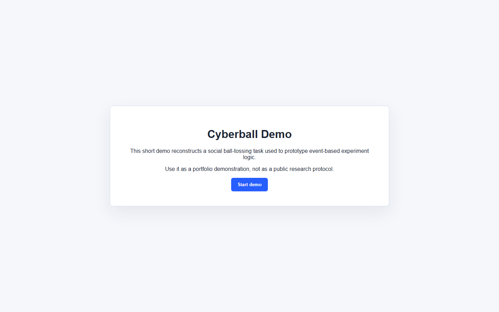
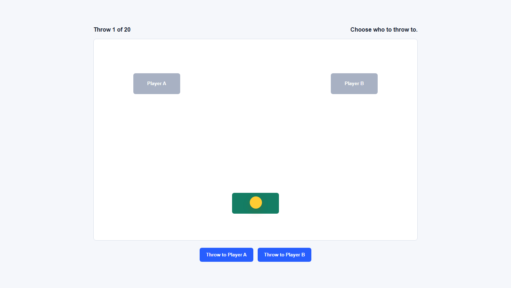
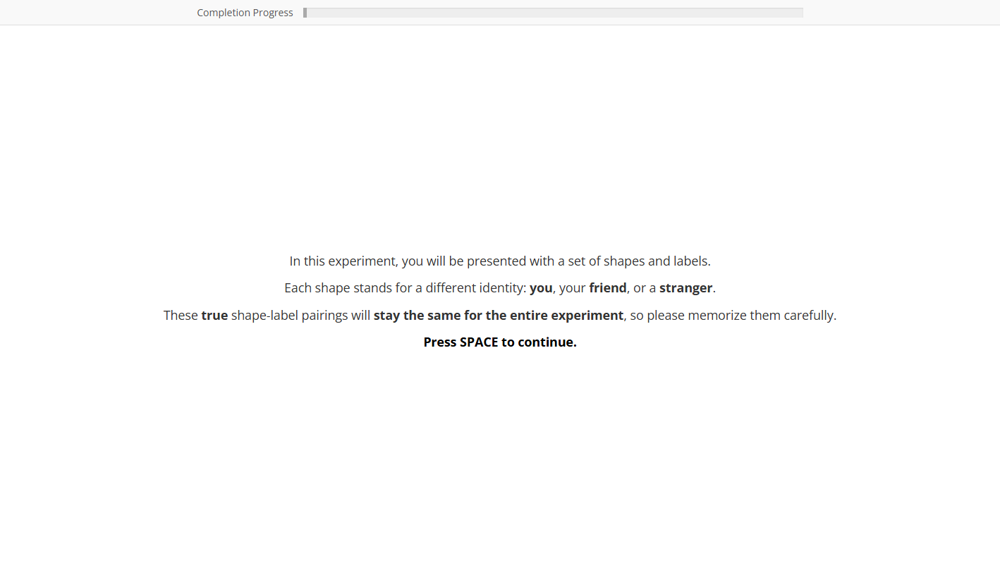
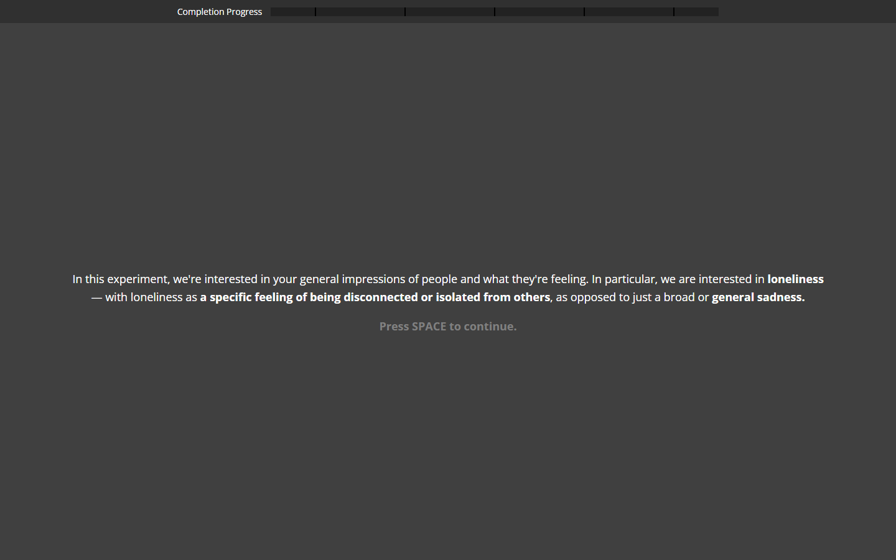
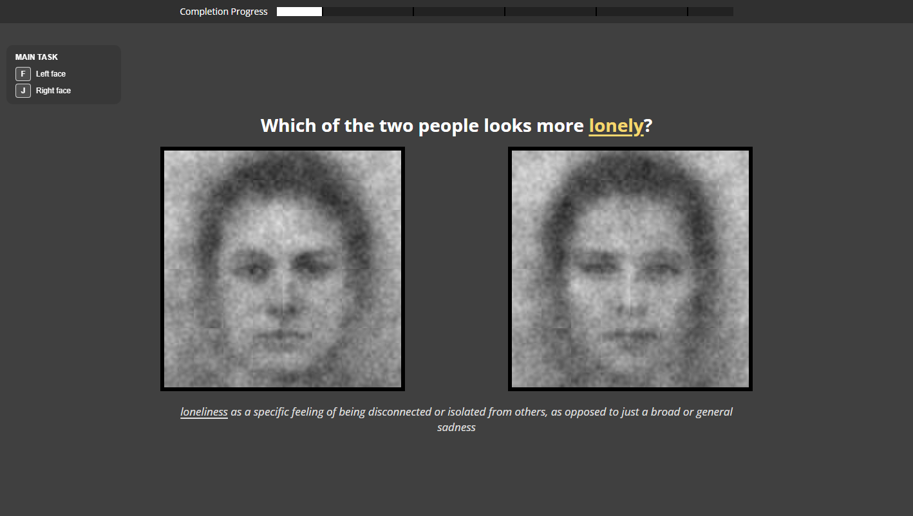

# Behavioral Experiment Demo Portfolio

Browser-based psychology experiment demos and analysis workflows by Matthew Lim.

This repository is a sanitized portfolio version of three behavioral experiment builds I worked on while supporting an ongoing psychology research project with a research partner. The broader research direction concerns loneliness, social perception, and how people respond to socially meaningful cues. The private study materials, participant data, and direct research-contact details have been removed.

The goal of this portfolio is to show how I think through experimental programming: turn a psychological idea into a controlled browser task, collect clean trial-level data, and build analysis scripts that can move from raw CSVs to interpretable summaries.

## Table Of Contents

- [Background](#background)
- [Project Status](#project-status)
- [Repository Structure](#repository-structure)
- [Demos](#demos)
- [Running The Demos](#running-the-demos)
- [Data And Analysis](#data-and-analysis)
- [Privacy](#privacy)
- [Built With](#built-with)
- [Acknowledgements](#acknowledgements)
- [Maintainer](#maintainer)

## Background

The three demos show a progression across different parts of a behavioral research workflow.

First, the ball tossing task simulates a social interaction in which the participant appears to play with other people. This type of task is useful when researchers want to study social inclusion, exclusion, and how participants interpret online social feedback.

Second, the memory shape name identification task tests whether socially meaningful labels can change how quickly and accurately people judge simple visual pairings. It is a more controlled cognitive task: participants learn mappings, respond under speeded conditions, and the analysis focuses on accuracy and response patterns.

Third, the intrinsic image identification task uses noisy face pairs to study social perception more directly. Instead of assuming ahead of time which facial features matter, participants choose which face better matches an impression. Their selected noise patterns can then be averaged into classification images and analyzed with facial-feature tools.

Across the three builds, the emphasis is the same: make the task precise enough for data collection, transparent enough for later analysis, and simple enough that another researcher can understand what the code is doing.

## Project Status

This is a portfolio demo repository, not a public release of the live study. The experiments are shortened for review, and private materials have been removed. The code is meant to show experiment structure, data capture, and analysis workflow.

## Repository Structure

```text
experiment-demo-portfolio/
+-- 01-ball-tossing-task-demo/
+-- 02-memory-shape-name-identification-task-demo/
+-- 03-intrinsic-image-identification-task-demo/
+-- screenshots/
+-- .gitignore
+-- README.md
```

### Top-Level Items

- `01-ball-tossing-task-demo/`: Browser demo for a programmed social ball-tossing interaction.
- `02-memory-shape-name-identification-task-demo/`: Browser demo and R analysis for a memory shape name identification task.
- `03-intrinsic-image-identification-task-demo/`: Browser demo, stimulus-generation code, and R analyses for a face-perception task.
- `screenshots/`: Images used in this README and portfolio write-ups.
- `.gitignore`: Keeps generated data, temporary analysis outputs, and local system files out of version control.

## Demos

### 1. Ball Tossing Task





This demo presents an online ball-tossing interaction. The participant sees other players on screen and makes passing decisions during the game. The task structure is controlled by the program, which makes it possible to prototype inclusion and exclusion conditions while keeping the browser experience natural for the participant.

What this folder shows:

- jsPsych timeline setup for a multi-phase browser experiment.
- A custom ball-tossing task plugin.
- Practice and main-game phases.
- Survey and debrief flow.
- CSV data saving through a small PHP endpoint.

Key files:

- `01-ball-tossing-task-demo/index.html`
- `01-ball-tossing-task-demo/expt.html`
- `01-ball-tossing-task-demo/exp/`
- `01-ball-tossing-task-demo/jspsych-6/plugins/demo-ball-tossing-task.js`
- `01-ball-tossing-task-demo/write_data.php`

### 2. Memory Shape Name Identification Task




This demo presents a memory task where participants learn mappings between identity labels and simple shapes. After learning the mappings, they judge whether later pairings match or mismatch what they learned.

What this folder shows:

- Instruction and learning screens.
- Practice logic with feedback.
- Main matching trials.
- Trial-level response logging.
- R analysis for combining CSV files and summarizing task performance.

Key files:

- `02-memory-shape-name-identification-task-demo/expt.html`
- `02-memory-shape-name-identification-task-demo/exp/`
- `02-memory-shape-name-identification-task-demo/images/`
- `02-memory-shape-name-identification-task-demo/memory_shape_name_identification_analysis.R`
- `02-memory-shape-name-identification-task-demo/write_data.php`

### 3. Intrinsic Image Identification Task





This demo presents pairs of noisy faces. Participants choose which face better matches a target impression. The responses are saved with the stimulus identifiers needed to reconstruct classification images later in R.

What this folder shows:

- Face-pair trial presentation.
- Block-level task prompts.
- Controlled stimulus pairing.
- Classification-image reconstruction in R.
- Secondary OpenFace-style feature analysis for generated face images.
- A bundled Psychomorph helper for stimulus preparation.
- An OpenFace analysis workflow, with OpenFace downloaded separately because the Windows binary and model files are large.

Key files:

- `03-intrinsic-image-identification-task-demo/expt.html`
- `03-intrinsic-image-identification-task-demo/exp/`
- `03-intrinsic-image-identification-task-demo/images/`
- `03-intrinsic-image-identification-task-demo/generate_rc_stimuli.R`
- `03-intrinsic-image-identification-task-demo/intrinsic_image_identification_data_analysis.R`
- `03-intrinsic-image-identification-task-demo/intrinsic_image_identification_secondary_openface_analysis.R`
- `03-intrinsic-image-identification-task-demo/tools/psychomorph/`
- `03-intrinsic-image-identification-task-demo/tools/openface/README.md`
- `03-intrinsic-image-identification-task-demo/write_data.php`

## Running The Demos

Each demo can be opened from its HTML entry point:

- `01-ball-tossing-task-demo/index.html`
- `02-memory-shape-name-identification-task-demo/expt.html?participant=demo`
- `03-intrinsic-image-identification-task-demo/expt.html?participant=demo`

Opening the HTML files directly is enough for visual review. To save CSV files through `write_data.php`, run the folders from a PHP-capable local server or web server.

The demo versions use reduced trial counts so the tasks can be reviewed quickly. The code is structured so trial counts and task settings can be adjusted from the parameter files.

## Data And Analysis

The browser tasks collect trial-level CSV data through jsPsych. The R scripts are written to read those CSVs from each task's `data/` folder, clean the records, and produce summaries or reconstructed images.

For the memory shape name identification task, the analysis focuses on response accuracy, response timing, and condition-level summaries.

For the intrinsic image identification task, the analysis has two stages:

1. Reconstruct classification images from selected and non-selected noise patterns.
2. Extract secondary facial-feature measures from those images using OpenFace-style outputs.

OpenFace is not bundled in this repository because its Windows binary and model files are large. To run the secondary OpenFace analysis, download OpenFace separately and place `FaceLandmarkImg.exe` at the path described in `03-intrinsic-image-identification-task-demo/tools/openface/README.md`.

Generated CSVs, interaction logs, and analysis outputs are intentionally ignored by Git so this repository can stay focused on the reproducible code and demo assets.

## Privacy

This is a portfolio-safe version of the project. It does not include:

- Participant CSV files.
- Private consent materials.
- Direct research-contact emails.
- Names of collaborators or lab members.
- Study materials that are not needed to understand the programming workflow.

## Built With

- JavaScript
- HTML/CSS
- jsPsych
- PHP
- R
- Psychomorph tooling
- OpenFace tooling, downloaded separately for secondary analysis

## Acknowledgements

These demos build on established behavioral experiment paradigms and open-source research tools. Some starting structure came from instructional browser-experiment boilerplate and was modified for the needs of these prototypes.

The repository is meant to show implementation, analysis planning, and research coding workflow rather than to release the private study itself.

## Maintainer

Matthew Lim
